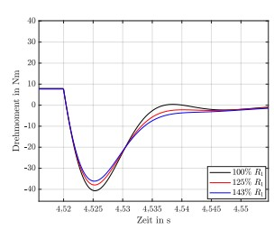
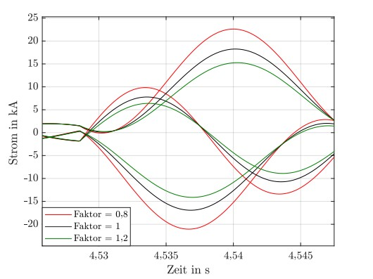
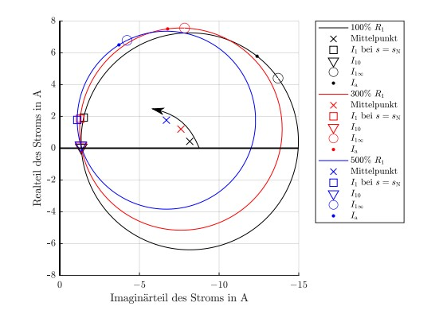
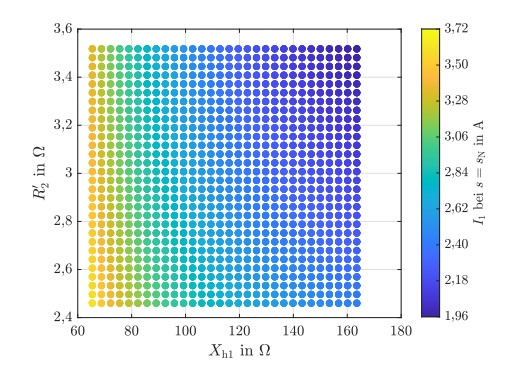

# Sensitivity Analysis of Equivalent Circuit Parameters in Induction Motors

## Project Overview
This project conducts a comprehensive sensitivity analysis of various equivalent circuit parameters in squirrel-cage induction motors. The study investigates how parameter variations, such as changes in resistance and reactance, impact the performance of the motors. The goal is to evaluate both the transient behavior, such as responses to short-circuit events, and steady-state conditions, particularly focusing on torque-speed characteristics.

## Key Components:
- **Simulation Tools:** MATLAB & Simulink
- **Motors Studied:** Two squirrel-cage induction motors with different power ratings:
  - **Motor 1:** 1.1 kW
  - **Motor 2:** 6.3 MW
- **Analysis Focus:**
  - **Torque-Speed Curve Analysis:** Examining how motor torque changes with speed under varying parameter conditions.
  - **Sensitivity Analysis:** 
    - **Screening (One-at-a-Time)**: Investigating the impact of individual parameters.
    - **Local Sensitivity Methods**: Evaluating sensitivity across multiple parameters.
  - **Parameter Variations:**
    - Stator Resistance (R1)
    - Rotor Resistance (R’2)
    - Stator and Rotor Leakage Reactances (Xσ1, Xσ2)
    - Main Reactance (Xh1)

## Tools and Software

- 
  **MATLAB:** Used for implementing the sensitivity analysis and steady-state simulations.

- 
  **Simulink:** Employed to simulate dynamic behaviors such as short circuits and transient responses.

- 
  **CSV Output:** Simulation results are stored in CSV files for further analysis and visualization.

- 
  **Data Visualization Tools:** MATLAB's plotting capabilities are used to create detailed graphs of motor performance under different conditions.

## Setup Instructions:
1. **Clone the repository:** Download the project from the GitHub repository.
2. **Ensure Software Installation:** Verify that MATLAB and Simulink are installed and configured on your computer.
3. **Run the Simulations:** Navigate to the `/src` directory, where the simulation files are located, and execute the `.m` scripts or open the Simulink model for short-circuit analysis.
## Results

The sensitivity analysis revealed several important findings regarding the impact of parameter variations on the performance of the induction motors. The analysis focused on both **steady-state** and **transient conditions** for two different motors. The following results summarize key observations:

### 1. **Impact on Torque-Speed Characteristics**

- **Stator Resistance (R1):**
  - **Motor 1**: The variation of R1 significantly affects the starting torque and the breakdown torque. An increase in R1 leads to a decrease in torque, particularly at startup and near the breakdown point.
  - **Motor 2**: The impact of R1 is negligible in Motor 2 across all operational conditions.
  
- **Rotor Resistance (R’2):**
  - **Both Motors**: An increase in R’2 improves the starting torque but decreases the rated torque. This effect is more pronounced in Motor 1.
  
- **Main Reactance (Xh1):**
  - **Both Motors**: Even small variations in Xh1 significantly affect the rated torque, with a stronger decrease observed in Motor 1 than Motor 2.

- **Leakage Reactances (Xσ1, Xσ2):**
  - **Both Motors**: An increase in total leakage reactance reduces torque. Both motors are more sensitive to a decrease in leakage reactance than an increase.

### 2. **Impact on Transient Behavior (Short-Circuit Conditions)**

- **Stator Resistance (R1):**
  - **Motor 1**: Variations in R1 cause notable changes in the peak short-circuit current and torque. The amplitudes of both quantities decrease as R1 increases.
  - **Motor 2**: There is a much smaller effect on Motor 2, indicating its lower sensitivity to R1 variations during short-circuit events.

- **Rotor Resistance (R’2):**
  - **Both Motors**: The variation in R’2 has a less significant effect on transient conditions. However, Motor 1 shows slightly larger deviations in short-circuit currents compared to Motor 2.

- **Main Reactance (Xh1):**
  - **Both Motors**: Xh1 has a significant impact on short-circuit behavior, particularly in Motor 1. Reducing Xh1 decreases the short-circuit current and torque amplitudes substantially.

- **Leakage Reactances (Xσ1, Xσ2):**
  - **Both Motors**: An increase in leakage reactance leads to a reduction in short-circuit current and torque amplitudes. A decrease in leakage reactance, however, results in stronger deviations, with Motor 1 being more sensitive than Motor 2.

### 3. **Summary of Sensitivity Analysis**

The table below summarizes the sensitivity of the induction motor parameters for both the steady-state and transient conditions:

| Parameter          | Motor 1 Impact               | Motor 2 Impact               |
|--------------------|------------------------------|------------------------------|
| **Stator Resistance (R1)** | Significant impact on startup and breakdown torque | Negligible impact |
| **Rotor Resistance (R'2)** | Improves startup torque, reduces rated torque | Similar trend, but less pronounced |
| **Main Reactance (Xh1)**   | Strong influence on rated torque and short-circuit behavior | Noticeable, but less significant |
| **Leakage Reactances (Xσ1, Xσ2)** | Large impact on torque reduction | Smaller impact, especially under transient conditions |
  
### 4. **Visual Documentation**

| Torque-Speed Characteristics           | Short-Circuit Current Response       |
|-----------------------------------------|--------------------------------------|
|    |  |
| *Figure 1: Torque-speed curve for Motor 1 with varying R1 values.* | *Figure 2: Current response during a short-circuit event, showing variations with different parameters.* |

| Current Phasor Representation           | Sensitivity Map                      |
|-----------------------------------------|--------------------------------------|
|    |  |
| *Figure 3: Phasor diagram showing real and imaginary parts of current under different R1 conditions.* | *Figure 4: Heatmap showing the sensitivity of rotor resistance (R'2) and main reactance (Xh1) on motor current.* |

## Conclusion:
This sensitivity analysis provides valuable insights into how parameter variations affect the performance of induction motors. The results can be used to optimize motor design and predict behavior under fault conditions, enhancing overall motor efficiency and reliability. The findings highlight the importance of rotor resistance and leakage reactances in both steady-state and transient operations.
